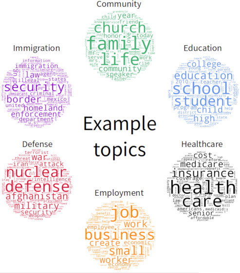

# Topic Modeling in Congressional Speeches

## Summary
In today's political climate, access to trustworthy information is more important than ever.
Yet, with social-media echo chambers and increasingly partisan news outlets, impartial connections to primary sources are becoming less common.
[Congress.gov](https://www.congress.gov) provides transcriptions of every speech given in congress since 1995, but search functionality is primitive and the volume of data (16k new words per day) makes finding information difficult.
Hillspeech helps interested citizens find the speeches they care about.

## Preprocessing
This project required an extensive data collection and preprocessing effort, including: writing a web-scraping engine to dynamically discover and parse 560 thousand web pages, implementing heuristic rules to annotate unstructured text, and storing data in a Mongo database for fast searching and retrieval.
The resulting 5 GB of data contained transcriptions of over 430 thousand speeches.

## Topic Modeling
I used Latent Dirichlet Analysis--an unsupervised semantic model--to determine which topics were most represented in the corpus of congressional speeches.
For example, the model found that words like "Medicare", "insurance", and "health" are generally used together in the same context.
This model allows any speech to be scored on its relevance to topics like gun control or immigration.

## Flask App
I have written a web app that integrates with the model and allows users to search for speeches that pertain to issues they consider important.
Results are filterable by date, speaker identity, and other metrics.
In this way, individuals can directly discover what their representatives are saying without relying on potentially biased sources.
